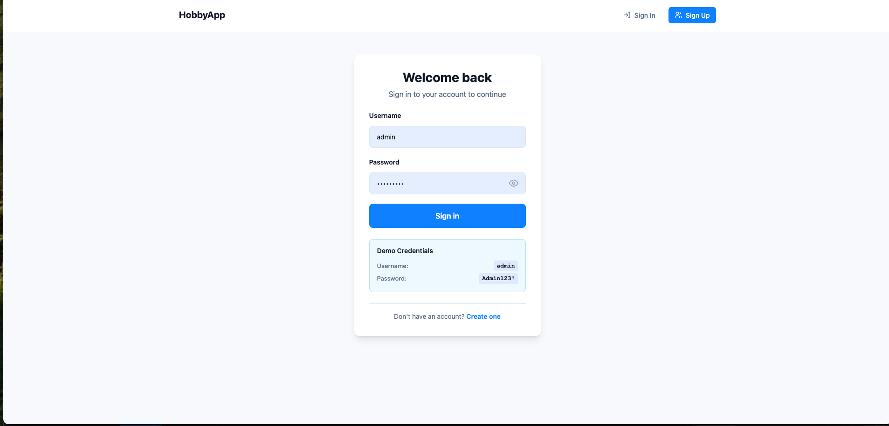

# HobbyApp Documentation

## Overview
HobbyApp is a modern .NET 8 web application for user management with hobby tracking and role-based access control. Built with Clean Architecture principles, it provides a comprehensive solution for managing users, their hobbies, and system roles.

## Key Features

### 🔐 Authentication & Authorization
- **JWT Authentication** with HttpOnly cookies for security
- **Role-Based Access Control (RBAC)** with Admin and User roles
- **Secure Login/Register** with password validation
- **Automatic token refresh** for seamless user experience

### 👥 User Management
- **Complete CRUD operations** for user accounts
- **Profile management** with personal information
- **Hobby tracking** with skill levels (Beginner, Intermediate, Expert)
- **Search and filtering** capabilities
- **Pagination** for large datasets

### 🛡️ Role Management
- **Dynamic role assignment** for administrators
- **Permission-based access control**
- **Admin-only features** protection
- **Last admin protection** (prevents removing the last admin)

### 🎨 Modern User Interface
- **Responsive design** that works on all devices
- **Card and List views** for user display
- **Real-time form validation** with instant feedback
- **Toast notifications** for user actions
- **Password visibility toggle** for better UX

---

## Feature Screenshots

### 1. User Authentication

#### Login Page

*Secure login with username/password validation and password visibility toggle*

#### Register Page  

*User registration with comprehensive validation and password confirmation*

### 2. User Management

#### User List View

*Comprehensive user listing with search, filtering, and toggle between card/list views*

#### User Search

*Real-time search functionality with instant results*

#### User Details

*Detailed user profile view with hobbies, roles, and action buttons*

#### Create New User

*Add new users with role assignment and hobby management*

#### Edit User

*Update user information, hobbies, and manage their data*

#### Delete User

*Safe user deletion with confirmation dialog (admin-only feature)*

### 3. Role Management

#### Role Management Interface

*Admin interface for managing user roles and permissions*

---

## Technical Features

### 🏗️ Architecture
- **Clean Architecture** with separation of concerns
- **SOLID Principles** implementation
- **Repository Pattern** for data access
- **Service Layer** for business logic
- **FluentValidation** for comprehensive input validation

### 🔧 Technology Stack
- **.NET 8.0** - Latest framework version
- **ASP.NET Core MVC** - Web framework with Razor Pages
- **Entity Framework Core** - ORM with Code First migrations
- **MySQL** - Database with Pomelo provider
- **JWT Authentication** - Secure token-based authentication
- **AutoMapper** - Object-to-object mapping
- **FluentValidation** - Input validation library

### 🚀 Key Capabilities

#### Security Features
- **JWT tokens** stored in HttpOnly cookies
- **CSRF protection** with antiforgery tokens
- **Role-based authorization** at controller and action level
- **Password hashing** using ASP.NET Core Identity
- **Input validation** on both client and server side

#### User Experience
- **Real-time validation** with instant feedback
- **Responsive design** for mobile and desktop
- **Toast notifications** for user actions
- **Loading states** and error handling
- **Accessibility features** with proper ARIA labels

#### Data Management
- **Automatic database migration** on startup
- **Data seeding** with default admin account
- **Data validation** at multiple layers

#### Performance
- **Efficient queries** with Entity Framework
- **Pagination** for large datasets
- **Lazy loading** for related data
- **Optimized JavaScript** for client interactions

---

## User Roles & Permissions

### 👤 User Role
- View own profile and details
- Edit own profile information
- Manage own hobbies
- Change own password
- View other users (limited information)

### 🛡️ Admin Role
- **All User permissions** plus:
- Create new users
- Edit any user's information
- Delete users (except themselves)
- Manage user roles
- Access role management interface
- View detailed user information
- System administration features

---

## Getting Started

### Prerequisites
- .NET 8.0 SDK
- MySQL Server 8.0+
- Your favorite IDE (VS Code, Visual Studio, Rider)

### Quick Setup
1. Clone the repository
2. Update connection string in `appsettings.json`
3. Run `dotnet restore`
4. Run `dotnet run`
5. Access at `https://localhost:5263`

### Default Accounts
| Role | Username | Email | Password |
|------|----------|-------|----------|
| Admin | admin | admin@hobbyapp.com | Admin123! |
| User | asep_wijaya | asep.wijaya@example.com | Password123! |

---

## Validation Features

### FluentValidation Implementation
- **Server-side validation** for all API endpoints
- **Client-side validation** with real-time feedback
- **Comprehensive error messages** for better UX
- **Business rule validation** (e.g., unique usernames/emails)

### Validation Rules
- **Username**: 3-50 characters, alphanumeric + underscore
- **Email**: Valid format, 5-255 characters
- **Password**: Min 6 chars, uppercase, lowercase, number required
- **Full Name**: 2-100 characters required
- **Hobbies**: Unique names, valid skill levels
- **Roles**: Valid role IDs, proper permissions

---

## Security Considerations

### Authentication Security
- JWT tokens in HttpOnly cookies (XSS protection)
- Secure token generation with proper expiration
- Refresh token mechanism for extended sessions
- Password hashing using industry standards

### Authorization Security
- Role-based access control implementation
- Method-level authorization attributes
- Resource-based authorization for user data
- Admin privilege escalation prevention

### Input Security
- FluentValidation for all user inputs
- SQL injection prevention through EF Core
- XSS protection through proper encoding
- CSRF protection with antiforgery tokens

---

## Troubleshooting

### Common Issues
1. **Database Connection**: Ensure MySQL is running and connection string is correct
2. **Migration Errors**: Use provided database reset commands in README
3. **Authentication Issues**: Clear browser cookies and try again
4. **Permission Denied**: Check user roles and permissions

### Database Reset Commands
```bash
# Option 1: Reset database completely
dotnet ef database drop --force
dotnet run

# Option 2: Manual database reset (MySQL)
mysql -u root -p
DROP DATABASE IF EXISTS hobbyapp_db;
CREATE DATABASE hobbyapp_db;
exit
dotnet run
```

---

*This documentation covers the main features of HobbyApp. For technical implementation details, please refer to the source code and inline comments.*
